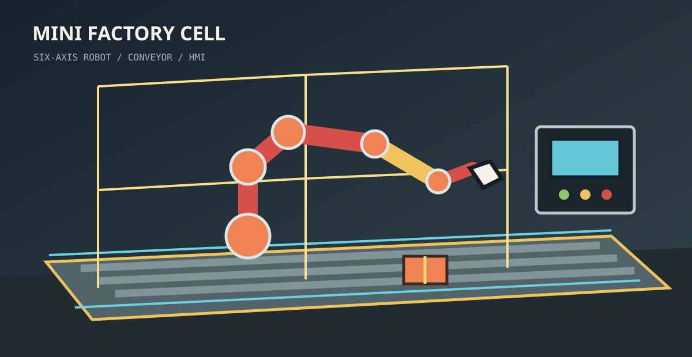

# Mini Factory Robot



Hai phiên bản mô phỏng một cell sản xuất nhỏ với robot arm 6 trục, băng tải, cảm biến, pallet, hàng rào an toàn và bảng điều khiển HMI. Repository này dùng để so sánh ứng dụng desktop C# với trải nghiệm 3D chạy trên trình duyệt.

## Hai phiên bản

| Project | Công nghệ | Mục tiêu | Nền tảng |
| --- | --- | --- | --- |
| `proj_1` | C# 10 + Raylib-cs | Mô phỏng desktop, render native, điều khiển bàn phím/chuột | Windows, Linux, macOS |
| `proj_2` | Three.js + Vite | Mô phỏng WebGL, dễ chia sẻ và chạy trên tablet | Desktop, Android, iPad qua trình duyệt |

## Tính năng

- Robot arm 6 trục tự thiết kế bằng hình học 3D.
- Chế độ Auto và Manual.
- Điều khiển từng trục J1-J6.
- E-stop và reset cell.
- Băng tải có con lăn, ray dẫn hướng, cảm biến và pallet.
- Thùng sản phẩm có nhãn và trạng thái xử lý.
- Safety cell với cột cảnh báo.
- Trạm HMI hiển thị trạng thái chạy, dừng và E-stop.
- Camera orbital để quan sát cell.

## Chạy `proj_1` - C# desktop

Yêu cầu: .NET SDK 10.0 trở lên.

```powershell
cd proj_1
dotnet restore
dotnet run --project robot_factory.csproj
```

Các module chính:

- `Program.cs`: khởi động window, camera và game loop.
- `SimulationState.cs`: trạng thái mô phỏng, băng tải và động học tự động.
- `RobotArm.cs`: hình học và render robot 6 trục.
- `FactoryCell.cs`: sàn, băng tải, cảm biến, pallet, hàng rào và HMI 3D.
- `InputController.cs`: bàn phím và click trên bảng điều khiển.
- `HudRenderer.cs`: HUD và bảng Robot Control.

### Điều khiển C#

- `Space`: chạy/dừng.
- `M`: Auto/Manual.
- `1` đến `6`: chọn trục J1-J6.
- `Left/Right` hoặc `W/S`: xoay trục trong Manual.
- `E`: E-stop.
- `R`: reset.
- Click panel: đổi mode, E-stop hoặc chọn trục.

## Chạy `proj_2` - Three.js

Yêu cầu: Node.js 20 trở lên.

```powershell
cd proj_2
npm install
npm run build
npm run preview -- --host 127.0.0.1
```

Mở `http://127.0.0.1:4173/` trong trình duyệt. Bản Three.js phù hợp để thử trên máy tính bảng vì không cần cài ứng dụng native.

## Thư viện

### C#

- [Raylib-cs](https://github.com/ChrisDill/Raylib-cs): cửa sổ, render 3D, camera, input.
- `System.Numerics`: vector và phép tính không gian 3D có sẵn trong .NET.

### Three.js

- [Three.js](https://threejs.org/): WebGL và scene 3D.
- [Vite](https://vite.dev/): dev server và production bundler.

## Cấu trúc repository

```text
.
├── docs/
│   └── factory-cell.svg
├── proj_1/
│   ├── FactoryCell.cs
│   ├── HudRenderer.cs
│   ├── InputController.cs
│   ├── Program.cs
│   ├── RobotArm.cs
│   ├── SimulationState.cs
│   └── robot_factory.csproj
├── proj_2/
│   ├── src/
│   ├── public/
│   ├── index.html
│   └── package.json
└── README.md
```

## Ghi chú

Đây là mô phỏng học tập và đánh giá công nghệ, chưa phải hệ thống điều khiển robot công nghiệp thật. Không kết nối project này trực tiếp vào robot hoặc dây chuyền đang vận hành nếu chưa bổ sung safety PLC, giới hạn hành trình, kiểm tra vùng nguy hiểm và giao thức điều khiển được chứng nhận.
